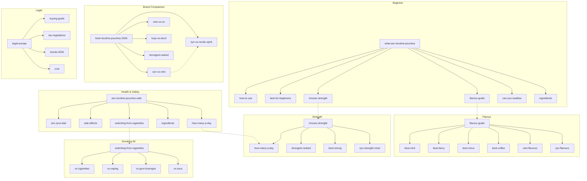

# Topic Cluster Mapping — Hub & Spoke SEO Architecture

8 topic clusters with hub pages and spoke articles. Each cluster links bidirectionally: hub links to all spokes, each spoke links back to hub and to 2–3 sibling spokes.

---

## Cluster 1: Beginner's Hub

**Hub page:** `/blog/what-are-nicotine-pouches` (existing)
**Target keyword:** nicotine pouches, what are nicotine pouches

| Spoke Article | Target Keyword | Link Anchor (from hub) |
|--------------|---------------|----------------------|
| how-to-use-nicotine-pouches | how to use nicotine pouches | Learn how to use them step by step |
| best-nicotine-pouches-for-beginners-2026 | best pouches for beginners | Our beginner recommendations |
| how-to-choose-your-strength | nicotine pouch strength guide | Choose the right strength |
| nicotine-pouch-flavour-guide | nicotine pouch flavours | Explore all flavour categories |
| can-you-swallow-nicotine-pouches | can you swallow nicotine pouches | What happens if you swallow one |
| nicotine-pouch-ingredients-explained | nicotine pouch ingredients | What is inside a pouch |

**Cross-links between spokes:**
- how-to-use → how-to-choose-your-strength, can-you-swallow
- best-for-beginners → how-to-use, flavour-guide
- flavour-guide → best-mint, best-berry, best-citrus

---

## Cluster 2: Health & Safety Hub

**Hub page:** `/blog/are-nicotine-pouches-safe` (existing)
**Target keyword:** are nicotine pouches safe

| Spoke Article | Target Keyword | Link Anchor (from hub) |
|--------------|---------------|----------------------|
| are-zyns-bad-for-you | are zyns bad for you | ZYN-specific health concerns |
| nicotine-pouch-side-effects | nicotine pouch side effects | Common side effects |
| how-many-nicotine-pouches-a-day | how many pouches a day | Safe daily limits |
| nicotine-pouch-ingredients-explained | pouch ingredients | What is inside a pouch |
| switching-from-cigarettes-to-nicotine-pouches | switching from smoking | Harm reduction for smokers |

**Cross-links between spokes:**
- are-zyns-bad → side-effects, how-many-a-day
- side-effects → ingredients, are-zyns-bad
- switching → how-many-a-day, are-nicotine-pouches-safe

---

## Cluster 3: Brand Comparison Hub

**Hub page:** `/blog/best-nicotine-pouches-2026` (existing)
**Target keyword:** best nicotine pouches 2026

| Spoke Article | Target Keyword | Link Anchor (from hub) |
|--------------|---------------|----------------------|
| zyn-vs-velo-2026 | zyn vs velo | ZYN vs VELO head-to-head |
| velo-vs-on-nicotine-pouches | velo vs on | VELO vs ON! comparison |
| zyn-vs-nordic-spirit | zyn vs nordic spirit | ZYN vs Nordic Spirit |
| loop-vs-skruf | loop vs skruf | LOOP vs Skruf |
| velo-vs-nordic-spirit | velo vs nordic spirit | VELO vs Nordic Spirit |
| strongest-nicotine-pouches-ranked-2026 | strongest nicotine pouches | Strongest pouches ranked |
| best-budget-nicotine-pouches | budget nicotine pouches | Best value picks |

**Cross-links between spokes:**
- zyn-vs-velo → zyn-vs-nordic-spirit, velo-vs-on
- loop-vs-skruf → best-nicotine-pouches-2026
- strongest-ranked → how-to-choose-your-strength

---

## Cluster 4: Flavour Guide Hub

**Hub page:** `/blog/nicotine-pouch-flavour-guide` (existing)
**Target keyword:** nicotine pouch flavours

| Spoke Article | Target Keyword | Link Anchor (from hub) |
|--------------|---------------|----------------------|
| best-mint-nicotine-pouches-2026 | best mint nicotine pouches | Best mint pouches |
| top-10-mint-flavours | mint nicotine pouches ranked | Mint rankings |
| best-berry-nicotine-pouches | best berry pouches | Best berry pouches |
| best-citrus-nicotine-pouches | best citrus pouches | Best citrus pouches |
| best-coffee-nicotine-pouches | coffee nicotine pouches | Best coffee pouches |
| all-velo-flavors-ranked-2026 | velo flavours ranked | Every VELO flavour ranked |
| zyn-flavours-complete-guide | zyn flavours guide | Every ZYN flavour reviewed |

**Cross-links between spokes:**
- best-mint → top-10-mint (overlap — consider consolidating)
- best-berry → best-citrus (flavour comparison context)
- all-velo-flavors → zyn-flavours (cross-brand comparison)

---

## Cluster 5: Strength & Dosing Hub

**Hub page:** `/blog/how-to-choose-your-strength` (existing)
**Target keyword:** nicotine pouch strength

| Spoke Article | Target Keyword | Link Anchor (from hub) |
|--------------|---------------|----------------------|
| how-many-nicotine-pouches-a-day | how many pouches per day | Daily dosing guide |
| strongest-nicotine-pouches-ranked-2026 | strongest pouches | The strongest options |
| best-strong-nicotine-pouches | strong nicotine pouches | Best strong pouches |
| zyn-strength-chart-every-level-explained | zyn strength chart | ZYN strength breakdown |
| strongest-snus-brands-compared-beginners-warning | strongest snus vs pouches | Snus vs pouch strength |
| best-nicotine-pouches-all-day-use | all day nicotine pouches | Best for all-day use |

**Cross-links between spokes:**
- strongest-ranked → best-strong, zyn-strength-chart
- how-many-a-day → how-to-choose-your-strength
- zyn-strength-chart → zyn-nicotine-pouches-complete-guide

---

## Cluster 6: Smoking Alternatives Hub

**Hub page:** `/blog/switching-from-cigarettes-to-nicotine-pouches` (existing)
**Target keyword:** switch from smoking to nicotine pouches

| Spoke Article | Target Keyword | Link Anchor (from hub) |
|--------------|---------------|----------------------|
| nicotine-pouches-vs-cigarettes | pouches vs cigarettes | Full comparison |
| nicotine-pouches-vs-vaping | pouches vs vaping | Pouches vs vaping |
| nicotine-pouches-vs-gum-vs-lozenges | pouches vs gum vs lozenges | NRT alternatives |
| nicotine-pouches-vs-snus | pouches vs snus | Pouches vs snus |
| best-nicotine-pouches-for-quitting-smoking | pouches for quitting | Best brands for switchers |

**Cross-links between spokes:**
- vs-cigarettes → vs-vaping, switching-from-cigarettes
- vs-vaping → vs-cigarettes, vs-gum-lozenges
- vs-snus → what-are-nicotine-pouches

---

## Cluster 7: Brand Deep-Dive Hub

**Hub page:** `/brands` (index page — existing)
**Target keyword:** nicotine pouch brands

| Spoke Article | Target Keyword | Link Anchor (from hub) |
|--------------|---------------|----------------------|
| zyn-nicotine-pouches-complete-guide | zyn nicotine pouches | ZYN complete guide |
| velo-nicotine-pouches-complete-guide | velo nicotine pouches | VELO complete guide |
| loop-nicotine-pouches-complete-guide | loop nicotine pouches | LOOP complete guide |
| nordic-spirit-nicotine-pouches-complete-guide | nordic spirit pouches | Nordic Spirit guide |
| on-nicotine-pouches-complete-guide | on nicotine pouches | ON! complete guide |
| pablo-nicotine-pouches-complete-guide | pablo nicotine pouches | Pablo guide |
| siberia-nicotine-pouches-complete-guide | siberia nicotine pouches | Siberia guide |
| skruf-nicotine-pouches-complete-guide | skruf nicotine pouches | Skruf guide |
| white-fox-nicotine-pouches-complete-guide | white fox nicotine pouches | White Fox guide |
| fumi-nicotine-pouches-complete-guide | fumi nicotine pouches | Fumi guide |
| iceberg-nicotine-pouches-complete-guide | iceberg pouches | Iceberg guide |
| klar-nicotine-pouches-complete-guide | klar nicotine pouches | KLAR guide |
| rave-nicotine-pouches-review | rave nicotine pouches | RAVE review |

**Cross-links between spokes:**
- Each brand guide → its comparison article (zyn-guide → zyn-vs-velo, velo-guide → velo-vs-on)
- Each brand guide → flavour-specific lists (zyn-guide → zyn-flavours-guide)

---

## Cluster 8: Legal & Market Hub

**Hub page:** `/blog/nicotine-pouches-legal-europe-2026` (existing)
**Target keyword:** nicotine pouches legal europe

| Spoke Article | Target Keyword | Link Anchor (from hub) |
|--------------|---------------|----------------------|
| nicotine-pouch-buying-guide-europe | buying guide europe | European buying guide |
| nicotine-pouch-tax-regulations-2026 | nicotine pouch tax | Tax and regulations |
| nicotine-pouch-trends-new-brands-2026 | nicotine pouch trends 2026 | Market trends |
| how-much-do-nicotine-pouches-cost | nicotine pouch cost | Pricing guide |
| nicotine-pouch-subscription-guide | pouch subscription | Subscription options |

**Cross-links between spokes:**
- buying-guide → legal-europe, cost
- tax-regulations → legal-europe, trends
- trends → legal-europe, buying-guide

---

## Visual Cluster Map (Mermaid)

---

## Implementation Priority

| Priority | Action | Pages Affected |
|----------|--------|---------------|
| P0 | Add hub-to-spoke links on all 8 hub pages | 8 hubs |
| P0 | Add spoke-to-hub "back links" on all spoke articles | ~50 spokes |
| P1 | Add sibling cross-links within each cluster | ~30 insertions |
| P1 | Add cross-cluster links between related hubs | ~10 insertions |
| P2 | Consolidate overlapping content (best-mint vs top-10-mint) | 2 articles |
| P2 | Create missing hub content if hub pages are thin | Review 8 hubs |
